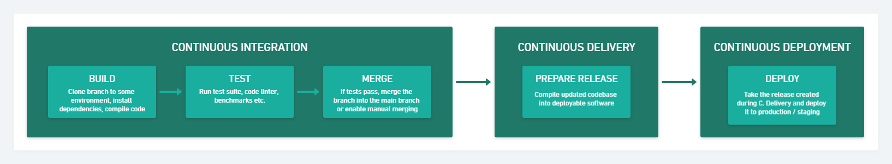

# Continuous Integration, Delivery & Deployment

Every time you create a pull request, GitHub Actions will look at the .yml files in the `./.github/workflows/` directory and perform the tasks defined in those files. `eslint src` checks that your code looks a certain way and if that's successful, it then tries to deploy the app to Heroku. For this to work properly, there are a couple of things you need to change in `./.github/workflows/main.yml`

## ./.github/workflows/main.yml

For the Heroku deployment to work, you must visit [Account Settings](https://dashboard.heroku.com/account) in your Heroku account and scroll to the bottom until you see _API Key_.

1. Copy the API key
2. Go to your forked project's repository on GitHub
3. Go to *Settings* -> *Secrets* -> *Actions* and click on *New repository secret*
4. Enter *HEROKU_API_KEY* as the name and paste the copied API Key as the value.
5. Edit the `.github/workflows/main.yml` file, changing the value of the `heroku_app_name` variable from `project-team-fullstack` to some unique name for your application
6. Change the value of the `heroku_email` variable from `edward@boolean.co.uk` to your email address

To monitor your newly configured workflow, whenever you push to main on your repository, visit the GitHub repo, and click _Actions_. Then click on the _Deploy_ workflow, and click on the latest workflow run - if you've been fast enough, it should still be running (since both the lint and test runs need to has to `npm install`, which should take a minute or two, and the Heroku deploy takes equally as long).

## Protect the `main` branch

1. Go to your forked repository settings in GitHub
2. Go to "Branches"
3. In "Branch Protection Rules", click "Add rule"
4. In the "Branch name pattern" field, enter `main`
5. Check the following boxes:
	- `Require a pull request before merging`
	- `Require approvals`
	- `Require status checks to pass before merging`
6. Click "Create" at the bottom of the page

Now it'll be impossible to push to the main branch; the only way to get your code merged in will be through a pull request that has at least 1 approval and passes the CI process.
