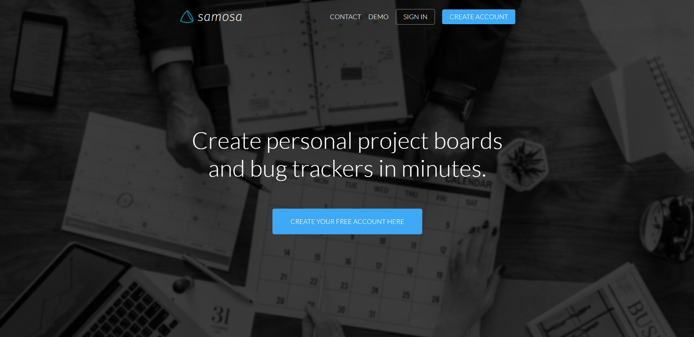
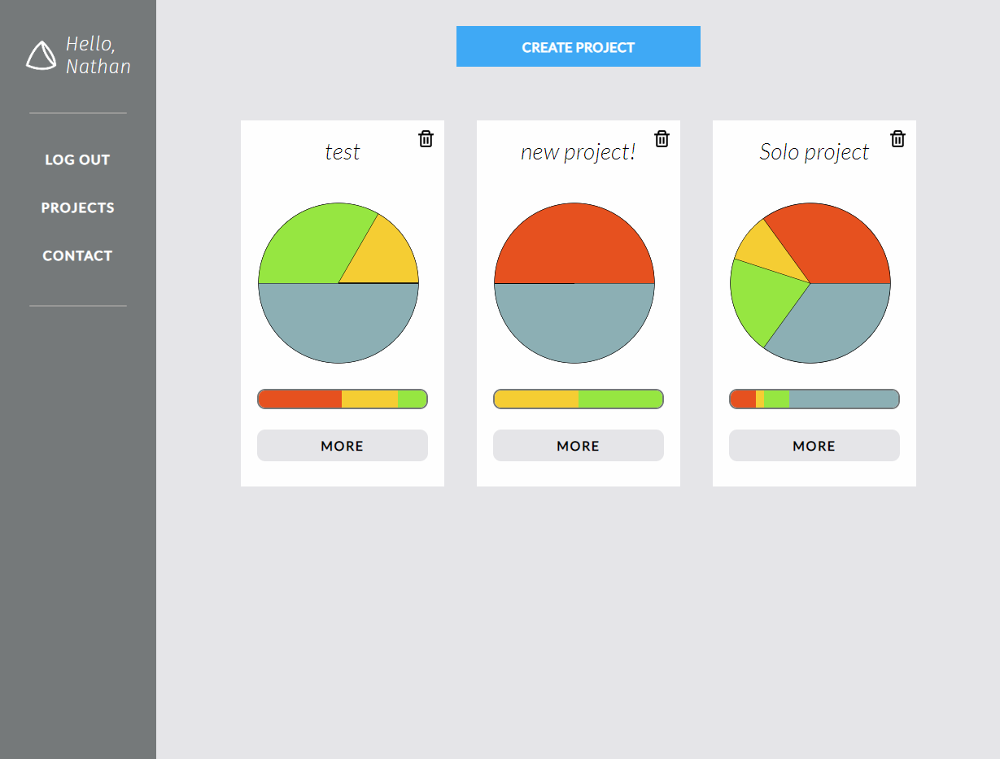
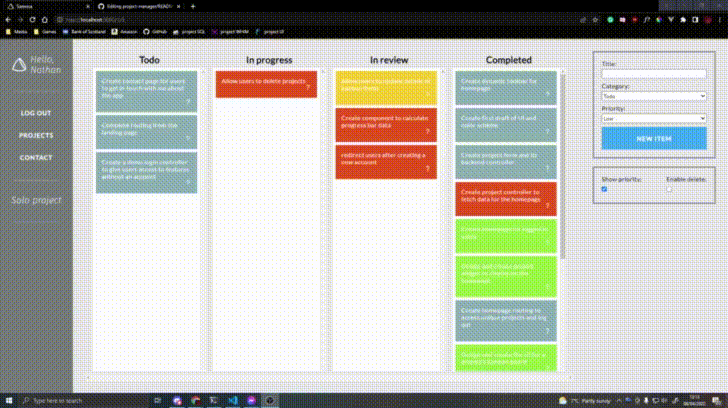

<h1 align="center">Samosa Project manger</h1>

  <strong>An in-browser appliation that provides tools to manage and track the progress of personal projects</strong>

## Preview

 

 

## Table of Contents

-   [Objectives](#Objectives)
-   [Features](#Features)
-   [Next steps](#Next)
-   [Installation](#installation)

## Objectives

-   Build an independant full-stack application using **React**, **Node.js**, **Express** and **PostgreSQL**.
-   Integrate fliud **drag and drop** functionality by updating local and server data simultaneously.
-   Practice the vue.js _State, Getters, Mutations, Actions_ model within the React.

## Next steps

## Installation

`npm install`

create a `.env` file containing:
- `DATABASE_URL` and `DATABASE_SHADOW` url from your private SQL.
- `NODE_ENV="development"`
- `REACT_APP_SERVER_URL=http://localhost:4000`
- `SECRET=[your-secret]`

run the client and server concurrently with `npm run devstart`
